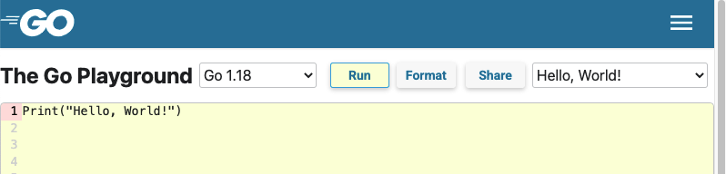
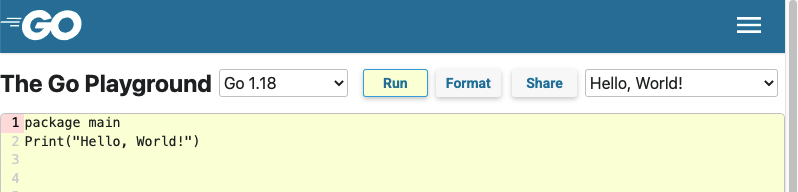
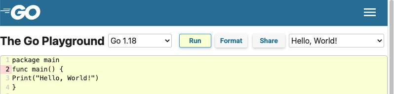
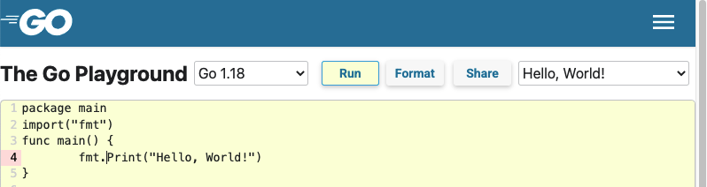
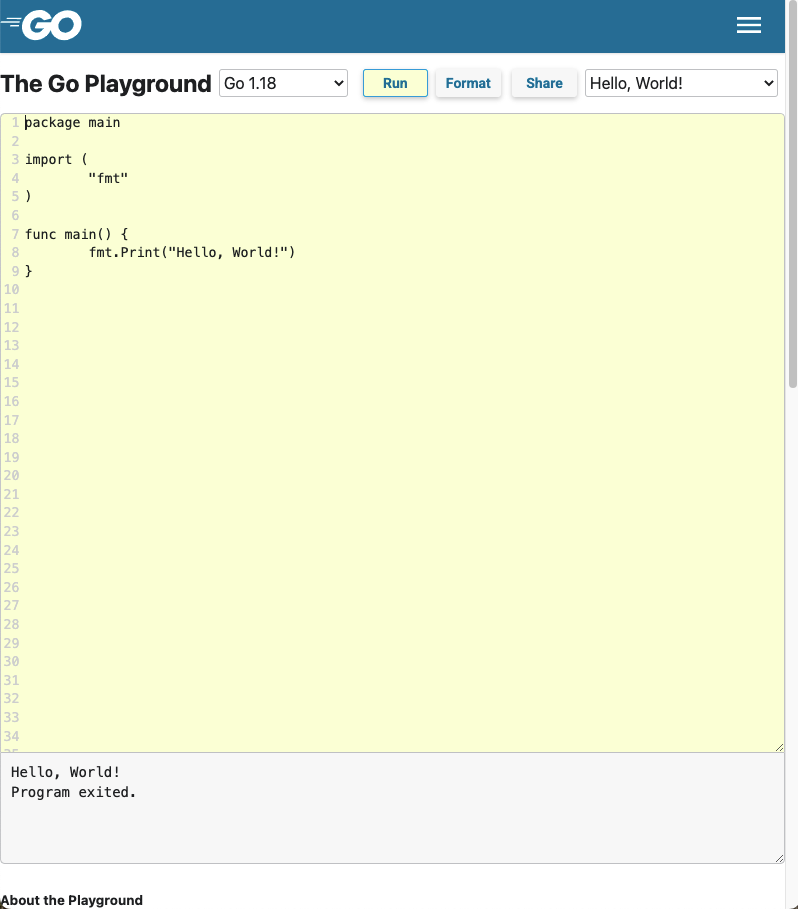

# Fundamentals

## Hello World

Hello, World! is the first basic program in any programming language. Let’s write the first program in the Go Language. To start, let's open a new clean Go playground using [this link](https://go.dev/play/p/e5pRTJVMIps)

Let's start by assembling the program. We want go to print "Hello, World!" by typing the following into the playground"

Go uses similar syntax to C, and the C-style Print command is a way to print output in Go.

`Print("Hello, World!")'

Your screen should look as follows:



Click the "Run" button in the menu bar and observe the output.  

You will see an error message as follows:

```
prog.go:1:1: expected 'package', found Print

Go build failed.
```

The program failed because Go expects a package and we did not define one.  Every program must start with the package declaration. In Go language, packages are used to organize and reuse the code.

Let's add the package main to our program by adding the following code in the first line of our program"

`package main`

Here, the package main tells the compiler that the package must compile in the executable program rather than a shared library.

After making this change, the code in your Go Playground should look as follows:



Let's run the code again by clicking the "Run" button and observe the output.

This time the build failed because of a non-declaration statement outside the function body with the following error message"

```
./prog.go:2:1: syntax error: non-declaration statement outside function body

Go build failed.
```

This error message tells us that we need a function to run our program.  The keyword `func` is used to create a function in Go.   `main` is the main function in Go language, which doesn’t contain the parameter, doesn’t return anything, and call when you execute your program.

Let's wrap our Print statement inside a function main to execute the program by adding the following code to our program around the existing Print statement:

```
func main() {
Print("Hello, World!")
}  
```
Your Go Playground should look as follows:



Let's run the code again by clicking the "Run" button and observe the output.

This time the build failed because of an Print is undefined:

```
./prog.go:4:2: undefined: Print

Go build failed.
```

We need to tell Go about Print and where to find the instructions on what to do when Print is called.  The Print method is present in fmt package and it is used to display “Hello, World!” string. The import keyword is used to import packages in your program and fmt package is used to implement formatted Input/Output with functions.

Let's add the import statement for "fmt" package to our program:

```
import ("fmt")
```
We need to tell Go to use Print from the fmt package by adding the prefix `fmt.` to our code as follows:

`fmt.Print("Hello, World!")

Your Go Playground should look as follows:


Let's run the code again by clicking the "Run" button and observe the output.

This time the build was successful and our program printed the output "Hello, World!" with a statement that the Program exited.

```
Hello, World!
Program exited.
```

You also notice that Go formatted the code when we clicked the "Run" button.  Our final code looks as follows after the formatting has been applied.




Congratulations! You have just completed your first Go program!


## Next Steps

The best way to learn Go's fundamentals is to first complete the official [Go Tour](https://tour.golang.org/). You will use an interactive web-based editor to accomplish basic tasks with the language. The first section covers basic syntax and data structures; the second discusses methods and interfaces; and the third introduces Go's concurrency primitives. Each section concludes with a few exercises so you can practice what you've learned. You can [take the tour online](https://go.dev/tour/) or install it locally with:
`$ go install golang.org/x/website/tour@latest` This will place the tour binary in your GOPATH's bin directory.

Next, you can check out some of the [Tutorials](https://go.dev/doc/tutorial) that are provided on the Go website. 

You may also wish to pick up [The Go Programming Language](https://www.gopl.io/) by Alan Donovan and Brian Kernighan.

To get started writing web applications, watch [A simple programming environment](https://vimeo.com/53221558) ([slides](https://go.dev/talks/2012/simple.slide)) and read the [Writing Web Applications tutorial](https://go.dev/doc/articles/wiki/).


[Back](README.md)