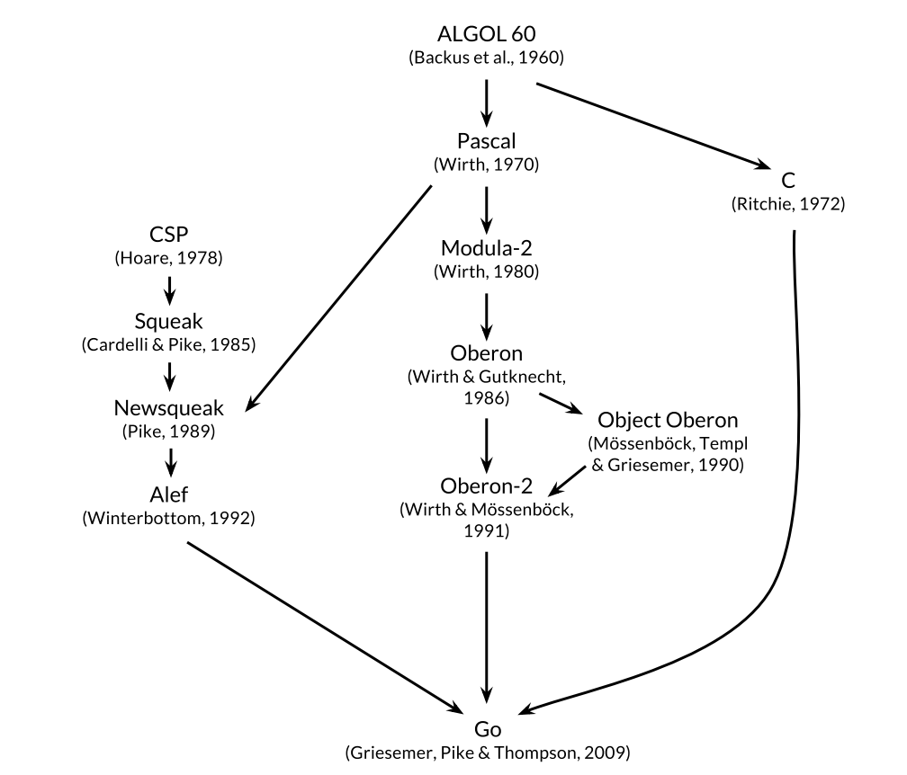

# Introduction

## Overview

Go is an open source programming language developed at Google that makes it easy to build simple and reliable software. It strives to be as simple as possible, but not simpler. It compiles to machine code, can be very efficient, and grows with grace.

Developed at Google in 2007, Go is a top-tier programming language. Today, Go is a Top 10 Language with 2+ Million Developers. What makes Go really shine is its efficiency; it is capable of executing several processes concurrently. And as far as programming languages go, it has an extensive “vocabulary,” meaning it can display more information than other languages. 

The best source of information about Go is the official web site at [go.dev](https://go.dev/).

Though it uses a similar syntax to C, Go is a standout language that provides top-notch memory safety and management features. Additionally, the language’s structural typing capabilities allow for a great deal of functionality and dynamism. Moreover, Go is not only high up on programmers’ most-loved and most-wanted lists — it also correlates to a 33% salary bump (PDF, 2.4 MB).

https://info.hackerrank.com/rs/487-WAY-049/images/HackerRank-2020-Developer-Skills-Report.pdf

## The Origins of Go

The figure below shows the most important infuences of earlier programming languages on the design of Go.

## Main Usage of Go

Go is a great choice for software engineering projects
go/why-go
https://go.dev/solutions/#case-studies

What this language is used for:
- API/RPC services (returning non-HTML)
- Web Services (returning HTML)
- Automation/Scripts
- Runnable/interactive program (CLI)
- Libraries or frameworks
- System/network programming 
- Audio/video editing 
- Big Data

## Interesting Facts About Go

- Robert Griesemer, Rob Pike, and Ken Thompson designed Go at Google in 2007.
- Google wants an alternative to C++ and solves the issues of software engineering, this gives rise to the development of the Go programming language.
- Go is an open-source project. Source code for its compiler, libraries, and tools is freely available to anyone.
- Go is sometimes described as a "C-like language", or as "C for the 21st century".
- Go is supported on almost every  Operating system like DragonFly BSD, FreeBSD, Linux, macOS, NetBSD, OpenBSD, Plan 9, Solaris, and Windows. 
- Go's standard library, often described as coming with "batteries included", provides clean building blocks and APIs for I/O, text processing, graphics, cryptography, networking, and distributed applications, with support for many standard file formats and protocols.
- The [Go Playground](https://go.dev/play/) provides the ability to run Go programs. It can be embedded within other pages or documentation pages.
- Go provides 2 features that are capable of replacing Class inheritance. The first is embedding and the other is interfaces.
- Go has garbage collection which automatically performs memory management and permits deferred execution of functions.
- In Go language, we don’t need to put a comma (, ) at the end of statements like Python.
- There is a special Keyword in Go called ‘defer‘, which delays the execution of method or function until the nearby function returns.
- Go has a special built-in function known as ‘make‘, which is used to create slices, maps, and channels.
- If any variable or package is declared but not used then, the Go compiler will show an error.
- In Go, there is a new data type known as ‘slice‘, which has a more powerful interface to sequences as compared to Arrays.
- Sometimes we want to import packages only for their side effects, without exploiting their use like import _ “net/http/pprof”. For this purpose, the Go language is very useful.
- The ‘Goroutines‘ is a special function in Go, which runs concurrently with other functions or methods. 
- In order to establish communication between goroutines. There exists a pipe known as ‘Channels‘.
- Go programs compile to a single binary and do not require any additional software to be installed in order to run them. Install the Go development tools only on computers that build Go programs.
- Go's method for publishing code is a bit different than most other languages. Go developers don't rely on a centrally hosted service, like Maven Central for Java or the NPM registry for JavaScript. Instead, they share projects via their source code repositories.
- Go does not allow flexibility on how the code is laid out and enforces a standard format.

## Comparison to other languages

### Comparison of Rust and Go

This article compares Rust and Go and makes the case that they are complimentary.

[Rust vs. Go: Why They're Better Together](https://thenewstack.io/rust-vs-go-why-theyre-better-together/)

## How Google Uses Go

[Using Go at Google](https://go.dev/solutions/google/)

- In 2015, to keep up with Google’s scale, Google’s Core Data Solutions team needed to rewrite the indexing stack from a single monolithic binary written in C++ to multiple components in a microservices architecture. The team decided to rewrite many indexing services in Go, which they now use to power the majority of their architecture. As a result, Google’s web indexing was re-architected within a year. More impressively, most developers on the team were rewriting in Go while also learning it.
- Behind the scenes, Chrome has an extensive fleet of backends. Among these is the Chrome Optimization Guide service. This service forms an important basis for Chrome’s user experience strategy, operating in the critical path for users, and is implemented in Go. Millions of users rely on this service to make their Chrome experience better. When the Chrome engineering team started building the service, only a few members had comfort with Go.
- Go is the language of choice for Google SRE teams. The majority of Google production is managed and maintained by our systems written in Go. Go’s simplicity means that the code is easy to follow, whether it is to spot bugs during review or when trying to determine exactly what happened during a service disruption.
- Go is used by the Google Cloud Platform team for solutions such as Anthos, GKE, and Istio
- The Firebase Hosting team has replaced 100% of backend Node.js code with Go. Hundreds of thousands of customers host their websites with Firebase Hosting, which means Go code is used to serve billions of requests per day. 
- Go is generally very readable and understandable. The language’s error handling, receivers, and interfaces are all easy to understand due to the idioms in the language.

## Go and Modern Enterprise Applications

### Fully Modern
- Decoupled from legacy libraries
- Learnable
- Productive
- Simple
- Cost reducing

Dropbox Quote:
"People become very productive in Go very fast, our infrastructure is built in Go today and all the new things we build in Go." Zviad Metreveli, Senior Principle Engineer, Dropbox

### Safety Features
- Memory safe by default
- Type-safe polymorphism
- Garbage-collected (low latency)

PayPal Quote:
"In our tightly managed environments where we run Go code, we have seen a CPU reduction of ~10% [vs C++] with cleaner and maintainable code." Bala Natarjan, Sr. Director of Engineering, Paypal

### Security Features
- Single binary
- Minimal dependencies
- Tamper-evident dependency chain
- State of the art encryption built in
- Supports distroless containers
- GCP-integrated vulnerability scanning

### Modular and Composable
- Composition over inheritance
- Concurrency
- Modular software design
- One pattern at every level

Monzo Quote:
"Go is a perfect language for creating microservices architectures, the concurrency features, and the language in general, has allowed the easy creation of small and simple networked services at Monzo." Matt Heath, Principal Software Engineer, Monzo

Cloudflare Quote
"I came for the easy concurrency, I stayed for the easy composition"
John Graham-Cumming, CTO, Cloudflare

Kubernetes Quote:
"Kubernetes' success is in part due to Go and the Go community. Go hits the sweet spot for distributed systems software."
Joe Beda, Kubernetes Creator, (formerly) Google

### Easily Maintainable
- High readability
- Ideal for dynamic teams
- Low maintenance

trivago Quote:
"Go's simplicity and its sophisticated tooling let us scale not only our service but more importantly, the process of software engineering itself. Reducing the friction of onboarding and training someone has significant impact on the company's productivity, even more so in a constantly moving environment like Trivago."
Martin Mai, Software Engineer, Trivago

American Express Quote:
"After working on Go, most of our developers don't want to go back to other languages."
Benjamin Cane, Vice President and Principal Engineer, American Express

### Scalable and Efficient
- High productivity
- High performance
- Native multi-core scaling

Mercado libre Quote:
"With Go, the company obviated 88% of their servers and cut CPU on the remaining ones in half - producing a tremendous cost-savings."
Eric Kohan, Software Engineer Manager, MercadoLibre

### Cloud Native Architecture
- First class cloud support
- Cloud native language
- Designed for containers

Movio Quote:
"Our Go microservices currently build in 5 seconds or less, test in 1 or seconds (including integration tests), deploy via Kubernetes new containers in 10 seconds or less"
Mariano Gappa, Software Engineer, Movio

### Event Driven / Serverless
- Broad support
- Instant startup times
- Cost effective
- Easy & fast deployment

## What's new in 1.18 Release

[Go 1.18](https://thenewstack.io/go-1-18-the-programming-languages-biggest-release-yet/)

[Back](README.md)

